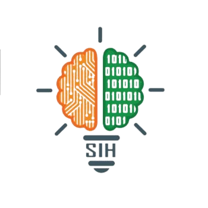

## OpenWeaver
- *AI Engineer Intern* | Sep'23 - Oct'23
- 
- Tags: Internships
- Badges:
  - Badge [blue]
- List Items:
  - Trained in Machine Learning techniques and learnedvarious tools like scikit-learn, tensorflow.
  - Worked onprojects like Breast Cancer Detection, Disease Prediction.

## Smart India Hackathon - Internal Hackathon
- *Team Leader* | Oct'23
- 
- Tags: Hackathons
- Badges:
  - Badge [blue]
- List Items:
  - Leaded a SIH Team named *'AYUMONK'*
  - Got 1st rank in internal hackathon.

## Software Development Cell
- *Core Team Member* | Jun'23 - Till Now
- 
- Tags: College Societies
- Badges:
  - Badge [blue]
- List Items:
  - Leaded some project teams and also worked as a team member for some projects.
  - Worked for a some of the college software projects like id-card generator,alumni management web portal etc in team which are in use by college in real life .